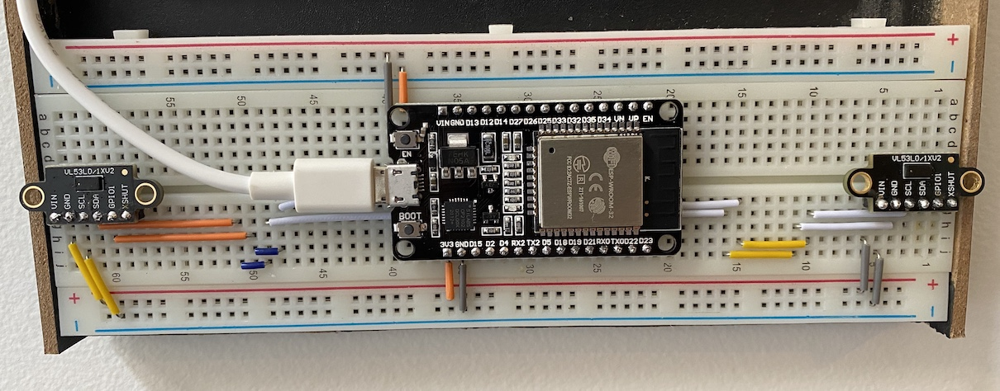
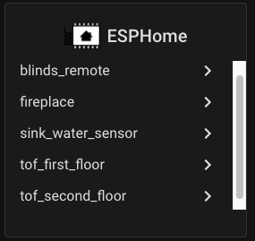
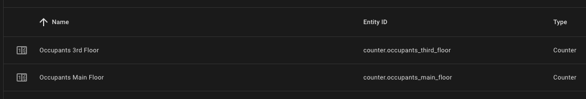
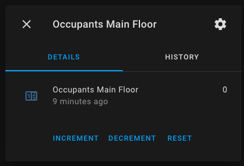
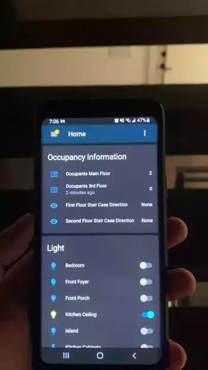

## 1.0 Purpose/Problem
My home has 4 stories and each floor is open concept. This makes it annoying to have to keep turning on lights and easy to forget to turn off lights. Instead of having to ask Alexa or use the HomeAssistant app to turn the lights on or off, it would be great if I can detect the number of occupants on each floor and turn the lights on and off. This can easily be done using PIR motion sensors to turn lights on and off, but I wanted to see if I can also count the number of people on each floor. By being able to know the number of people in the house and the number of people on each floor, it would open up opportunity for more automations.

## 2.0 Possible Solutions
There are multiple ways of counting the number of people in a room/area/floor. The following are some of the ways I explored.

### 2.1 Room-Assistant
One way I keep coming across is to use [room-assistant](https://www.room-assistant.io/) which can use a number of sensors to determine occupancy of a room. Some of the sensors/integrations that can be used in room-assistant are:
* Bluetooth Low Energy, which scans for devices that advertise, such as iBeacon or Bluetooth tags
* Bluetooth Classic, which tries to detect the location of Bluetooth devices within the home
* Thermopile sensors that measure the temperature on an 8x8 grid

#### 2.1.1 Pros
* Well supported project with a strong community
* Advice and gotchas related to placement of sensors
* Number of supported integrations that can help improve accuracy
* Configuration for integrations like BLE signal strength are supported out of the box
* {Still need to think of more}

#### 2.1.2 Cons
* I'm not a big fan of the first two bluetooh sensors since I don't want to have to carry my phone or a BLE device with me everywhere in the house.
* Thought dump (likely resolved): The thermopile solution would work and will be pretty cool way of doing it, but the logic to count the number of people on each floor might get a little complicated. Either I would have to have multiple per floor so I can constantly monitor all people on each floor or I would have to write logic for incrementing and decrementing occupancies as people appear and disappear on each floor. The logic would get a bit complicated as I will not get direction out of the box with thermopile.

### 2.2 Direction Sensor using ToF
Since my house is 4 floors, and all I want is to determine the number of people on each floor, I could build 3 'direction sensors' by putting two ToF sensors and an ESP8266 or ESP32. The arrangement of the two ToF sensors will can then be used to determine the direction of movement. I can then place each 'direction sensor' at each stair case to see if someone is going up or down the stairs. The circuit can be seen below (please excuse the constant hopping, this is a prototype)

<p>
    
</p>

#### 2.2.1 Pros
* No hardware required to be carried by people walking around (ie. no need to carry iBeacons or phones)
* It's fun to pretend I know what I'm doing

#### 2.2.2 Cons
* Cannot identify the person that is passing by
* Adding other occupancy sensors, like PIR sensors, to determine presense will have to be done manually
* Will have to manually tune the ESP code to consume less power
* Multiple people walking together side by side would be detected as one person

## 3.0 Proposal
Since I don't always carry my phone with me and would not like to carry around an iBeacon, I dont think I would take advantage of room-assistant's BLE or Bluetooth Classic integrations. Also, unlike the logic required for thermopile, it should be less effort to go with the ToF solution since I would know the direction of movement at each staircase and won't have to make assumptions. Because of these reasons, I think the ToF approach would be a good start.

## 3.1 Hardware Requirements
* Home Assistant Configured
* ESPHome installed
* ESP8266 or ESP32
* 2x VL53L0X
* Breadboard or home made PCB
* Wires

### 3.1.1 ESP Logic
oh boy this logic needs to be explained better, it had a lot of iterations, seems to be the one that works best for now. Ok low down, I initially just tried having the ESP send the ToF sensor reading to HA and added automation logic in HA by using Helper variables. The logic was as follows:

1. ToF Sensor 1 reports NaN
2. ToF Sensor 2 reports NaN
3. Person walks by Sensor 1 first around 50cm
4. ToF Sensor 1 reports 50cm
5. ToF Sensor 2 Reports NaN
6. HA automation to determine if user is moving from sensor1 to sensor2 is triggerd since Sensor 1 is not reporting between 0m to 1m
7. The automation sets a variable saying sensor 1 activated
8. Person walks by Sensor 2 now around 60cm (or whatever)
9. HA automation is triggered by sensor 2 since it's between 0m to 1m
10. The Automation checks if sensor 1 was activiated (if yes, then direction deteremined! if not then this actually means sensor 1 was not activaited)

The above logic is basically it, with a few timeouts in place that would reset 'sensor 1 activated' and the opposite direction (sensor 2 first then sensor 1) also needs to be defined. This did work, but not that great. Unforutnately, ESP was not very reliable in sending the location date to HA. Sometimes it was reported a little too late resulting to the variables being reset by the timer.

Instead, I decided to move the logic onto the ESP. Following the same flow, I had variables defined on the ESP and set the variables for the corresponding sensor. The variables would be set when sensors detect an object between 0m to 0.8m, it would then check to see if the other sensor's variable is also active, if so, then direction is determined! See logic for ESP below

```
esphome:
  name: tof_first_floor
  platform: ESP32
  board: esp-wrover-kit

globals:
 - id: sensor_1_is_active
   type: bool
   restore_value: no
   initial_value: 'false'
 - id: sensor_2_is_active
   type: bool
   restore_value: no
   initial_value: 'false'

i2c:
  - id: bus_a
    sda: 18
    scl: 5
    scan: True
  - id: bus_b
    sda: 23
    scl: 22
    scan: True

text_sensor:
  - platform: template
    name: "First Floor Stair Case Direction"
    id: first_floor_stair_case_direction

sensor:
  - platform: vl53l0x
    name: "First Floor Sensor 1 Distance"
    address: 0x29
    update_interval: 47ms
    long_range: False
    internal: True
    i2c_id: bus_a
    id: sensor_1
    on_value:
      then:
        if:
          condition:
              lambda: |-
                return id(sensor_1).state < 0.8 && id(sensor_1).state > 0 && !id(sensor_1_is_active);
          then:
            - globals.set:
                id: 'sensor_1_is_active'
                value: 'true'
            - if:
                condition:
                  lambda: |-
                    return id(sensor_2_is_active);
                then:
                  - text_sensor.template.publish:
                      id: first_floor_stair_case_direction
                      state: "Down"
                  - delay: 1s
                  - text_sensor.template.publish:
                      id: first_floor_stair_case_direction
                      state: "None"
            - delay: 2s
            - globals.set:
                id: 'sensor_1_is_active'
                value: 'false'
  - platform: vl53l0x
    name: "First Floor Sensor 2 Distance"
    address: 0x29
    update_interval: 43ms
    long_range: False
    internal: True
    i2c_id: bus_b
    id: sensor_2
    on_value:
      then:
        if:
          condition:
              lambda: |-
                return id(sensor_2).state < 0.8 && id(sensor_2).state > 0 && !id(sensor_2_is_active);
          then:
            - globals.set:
                id: 'sensor_2_is_active'
                value: 'true'
            - if:
                condition:
                  lambda: |-
                    return id(sensor_1_is_active);
                then:
                  - text_sensor.template.publish:
                      id: first_floor_stair_case_direction
                      state: "Up"
                  - delay: 1s
                  - text_sensor.template.publish:
                      id: first_floor_stair_case_direction
                      state: "None"
            - delay: 2s
            - globals.set:
                id: 'sensor_2_is_active'
                value: 'false'

wifi:
  ssid: "{SSID}"
  password: "{SSID_PASSWORD}"

  # Enable fallback hotspot (captive portal) in case wifi connection fails
  ap:
    ssid: "Tof First Floor Fallback Hotspot"
    password: "{AP_PASSWORD}"

captive_portal:

# Enable logging
logger:
  level: ERROR

# Enable Home Assistant API
api:

ota:

```

### 3.1.2 Home Assistant Configuration
The only home assistant configuration was to add the ESPs that have been deployed through ESPHome to HA. This was done by through integrations:

<p>
    
</p>

#### 3.1.2.1 Automation Configuration
Created two counter in automation Helpers to track occupancy for Main Floor (2nd floor) and 3rd Floor:

<p>
    
</p>

<p>
    
</p>

Automation to increment people in living room:
```
alias: 'Presence: Going to Living Room from 1st Floor'
description: ''
trigger:
  - platform: state
    entity_id: sensor.first_floor_stair_case_direction
    to: Up
condition: []
action:
  - service: counter.increment
    data: {}
    entity_id: counter.occupants_main_floor
mode: single
```

Automation to turn lights on if anyone is in living room:
```
alias: 'Presence: No one in living room'
description: ''
trigger:
  - platform: state
    entity_id: counter.occupants_main_floor
    to: '0'
condition: []
action:
  - service: light.turn_off
    data: {}
    entity_id: light.kitchen_ceiling
  - service: light.turn_off
    data: {}
    entity_id: light.island
  - service: light.turn_off
    data: {}
    entity_id: light.living_room
mode: single

```

## 4.0 The Result of Creating a Direction Sensor
It took a lot of trial an error to tune the code. Initially, I was having the ESP report the distance each ToF sensor was reading and was performing the direction determination logic within the HomeAssistant automation. Unfortunately, this proved to result to many false positive. {Need to expand on this part}. Instead, decided to move the logic onto the ESP and have the ESP determine the direction. This proved to be much more reliable, there are far less false positives but there still needs to be some tuning and cleaning up of the code.

<p>
    
</p>


## 5.0 Improvements and Potential Changes
* Clean up the ESP code, too many nested conditions
* Move away from having to emit 'Up'/'Down' and then 'None'. There isn't really a need to do this, it was just a quick workaround to get things working
* Explore deep, light, and modem sleep to use less power. Maybe can switch over to using a battery, that would be nice!
    * Currently consuming ~2watts {Need to add more stats here}
* Experiment with placement of the sensors (ie. half-way up the staircase...)
* Explore combining other sensors such as BLE or bluetooth classic to identify people
