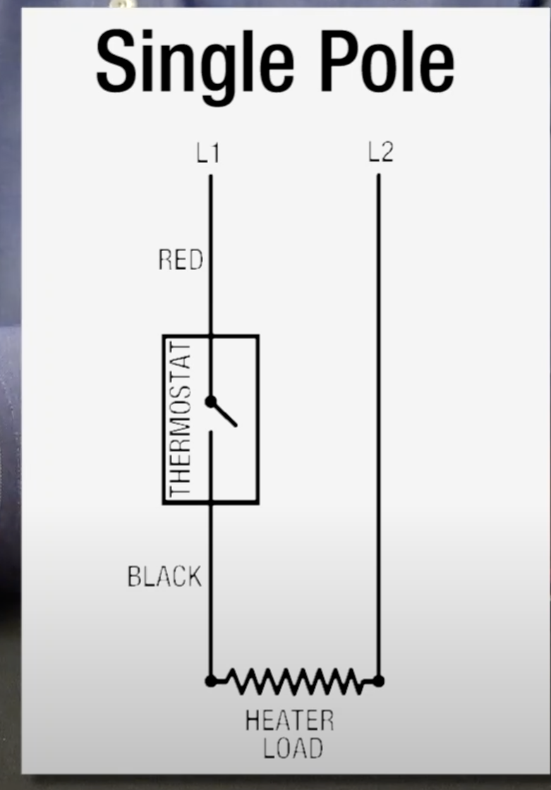
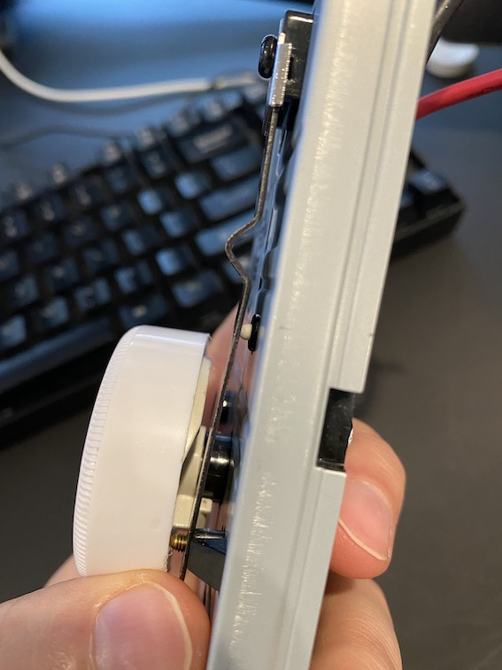
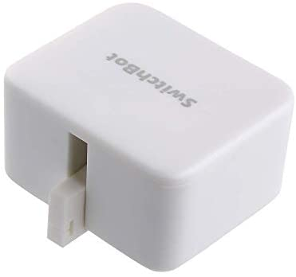
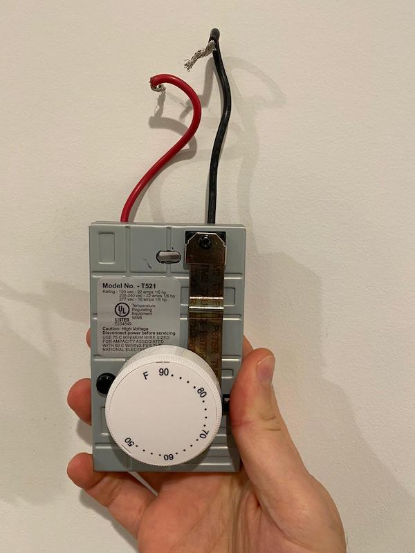
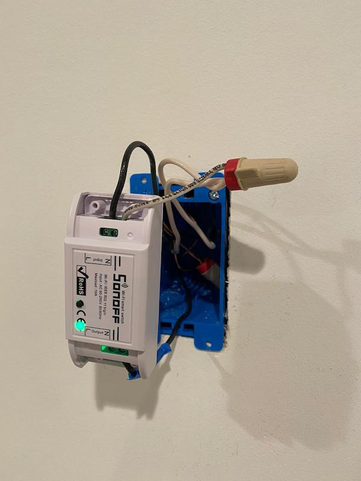
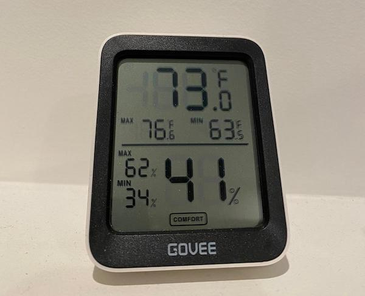
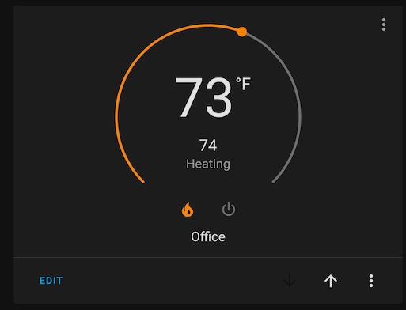

[Headers](#headers)
[Emphasis](#emphasis)
<a name="headers"/>

## Problem
My home is 4 stories and the builder was smart to put the furnace on the 4th floor. This made it super hard for the furnace to push heat down to the first floor bedroom that I use as an office. After working with them, they decided to install a 240V heater in the 1st floor bedroom and use a line voltage thermostat to controll it. This solution is not ideal since:
1. It is an electrical solution, now I have to pay more boo :(
2. It is controlled using old school thermostats that make it harder to control remotely. In the mornings it will take about 1 hour to heat up the room and I sometimes forget to turn it off (more money wasted boo)

## Making it a Smart Heater
The thermostat is a single-pole line voltage thermostat. Since the thermostat is manual, it is using a metal plate that expand based on the temperature and then if its too cold it would release a button that is pushed by default to turn it on. so when button is pushed the switch is closed and when its not pressed the switch is open and the power flows. This is important since it means if the button is not pressed the heater is on and if the button is pressed the the heater is off. The circuit diagram looks like this:

    

The physical button is the white small button under the lever, can see it here

    

### Minimally Invasive Solution
I tried making it smart. First, I tried to get a button pusher thats zwave controlled (see pic below) to just push or release the button. but it was super hard to calibrate it cuz its not powerful enough for the button. The button is very hard to push so it tries to push it and then backs off. So I tried to make a long lever to increase the torque, but the lever was a little flimsy and hard to keep from moving around. also the fact that when the button isn't pressed it means power flows and heater is on made it scary. If the button or lever fails then the heater will be on until I physically go and fix it. So not a great solution.

    

### More Invasive Solution
I ended up switching over to a sonoff switch. so basically took out the thermostat and put in a sonoff switch. its working really nicely now! can control from HomeAssistant and configured it to be a thermostat using hass by using the Bluetooth thermometer as input and the sonoff switch as the heater! so now its just as if its a real thermostat where it reads input from this BLE thermostat and then turning on the heater when needed. The awesome part is that homeassistant already has a default climate component where you provide the temp sensor and the heater entity and then it lets you set your desired temperature and it will do all the work! This also gets exposed to alexa so I can change the temperature by talking to Alexa. see below for pics. 

This the old thermostat:

    

This is the sonoff switch:

    

This is the Bluetooth thermometer:

    

Homeassistant climate UI component:

    

